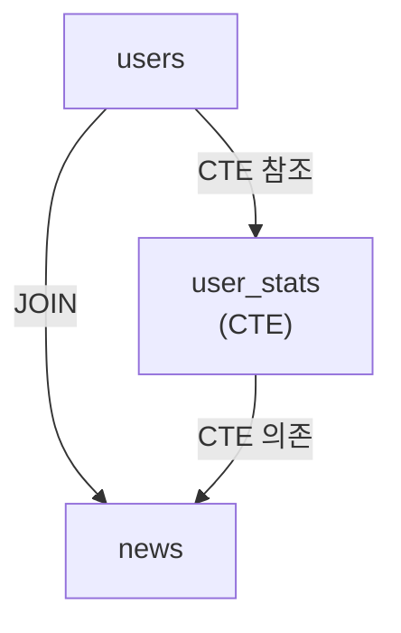

# 🔍 SQL 쿼리 분석 MCP 서버 완전 가이드

**작성일**: 2025년 1월  
**버전**: 1.0.0

> PostgreSQL 쿼리(3000-4000라인)를 자동으로 분석하여 구조, 성능, 최적화, 복잡도, 보안을 평가하고 JSON 및 마크다운 파일로 결과를 제공하는 MCP 서버

---

## 📋 목차

1. [개요](#개요)
2. [주요 기능](#주요-기능)
3. [설치 및 설정](#설치-및-설정)
4. [사용 방법](#사용-방법)
5. [분석 항목 상세 설명](#분석-항목-상세-설명)
6. [출력 형식](#출력-형식)
7. [예시](#예시)
8. [문제 해결](#문제-해결)

---

## 개요

**SQL 쿼리 분석 MCP 서버**는 PostgreSQL 쿼리를 자동으로 분석하여 다음과 같은 정보를 제공합니다:

- ✅ 쿼리 구조 분석 (테이블, 컬럼, JOIN, 서브쿼리 등)
- ✅ 성능 분석 (인덱스 사용, 풀 스캔 위험도 등)
- ✅ 복잡도 분석 (중첩도, 테이블 수 등)
- ✅ 보안 분석 (SQL Injection 취약점 등)
- ✅ 최적화 제안 (인덱스 제안, 쿼리 리팩토링 등)
- ✅ **데이터 리니지 분석** (테이블 간 관계, CTE 의존성, 서브쿼리 관계 시각화)
- ✅ JSON 및 마크다운 리포트 생성
- ✅ Mermaid 다이어그램을 통한 관계 시각화

### 지원하는 쿼리 타입

- **SELECT**: 조회 쿼리 분석
- **INSERT**: 삽입 쿼리 분석
- **UPDATE**: 수정 쿼리 분석
- **DELETE**: 삭제 쿼리 분석
- **CREATE**: DDL 쿼리 분석
- **멀티 쿼리**: 세미콜론으로 구분된 여러 쿼리 지원

---

## 주요 기능

### 1. 쿼리 구조 분석

쿼리의 구조를 자동으로 분석합니다:

- **테이블 추출**: FROM 절과 JOIN 절에서 테이블명 추출
- **컬럼 추출**: SELECT 절에서 컬럼명 추출
- **JOIN 분석**: JOIN 타입, 조건 분석
- **서브쿼리 분석**: 서브쿼리 위치, 타입, 중첩 깊이 분석
- **CTE 분석**: WITH 절 (Common Table Expression) 분석
- **WHERE/GROUP BY/ORDER BY 분석**: 각 절의 조건 분석

### 2. 성능 분석

쿼리의 성능을 평가하고 이슈를 식별합니다:

- **인덱스 사용 가능성**: WHERE, JOIN, ORDER BY 절의 인덱스 사용 가능 여부
- **풀 테이블 스캔 위험도**: WHERE 절이 없는 SELECT 쿼리 감지
- **비효율적인 JOIN 패턴**: CROSS JOIN, JOIN 조건 없음 감지
- **서브쿼리 성능 이슈**: 깊은 중첩, 과도한 서브쿼리 사용 감지
- **집계 함수 최적화**: COUNT, DISTINCT 사용 분석
- **LIMIT/OFFSET 효율성**: 큰 OFFSET 값 사용 감지
- **함수 사용 분석**: 인덱스 미사용 가능성 있는 함수 사용 감지

### 3. 복잡도 분석

쿼리의 복잡도를 평가합니다:

- **쿼리 길이**: 문자 수, 라인 수
- **테이블 수**: FROM 절과 JOIN 절의 테이블 수
- **JOIN 수**: JOIN 개수 및 중첩도
- **서브쿼리 수**: 서브쿼리 개수 및 최대 중첩 깊이
- **WHERE 조건 수**: 조건 개수
- **컬럼 수**: SELECT 절의 컬럼 수
- **UNION 수**: UNION 연산 개수

### 4. 보안 분석

쿼리의 보안 취약점을 검사합니다:

- **SQL Injection 취약점**: 문자열 연결, 동적 쿼리 생성 감지
- **권한 관련 이슈**: 과도한 권한 사용 감지
- **데이터 노출 위험**: SELECT * 사용, 불필요한 데이터 반환 감지
- **인젝션 패턴 감지**: UNION 기반, Boolean 기반 인젝션 패턴 감지

### 5. 최적화 제안

구체적인 최적화 제안을 제공합니다:

- **인덱스 제안**: 누락된 인덱스, 복합 인덱스 제안
- **쿼리 리팩토링**: 서브쿼리 → JOIN 변환, IN → EXISTS 변환 제안
- **조건 최적화**: WHERE 절 순서 최적화 제안
- **JOIN 최적화**: JOIN 순서 변경 제안
- **집계 최적화**: GROUP BY, HAVING 최적화 제안

---

## 설치 및 설정

### 1. 의존성 설치

```bash
pip install mcp sqlparse
```

또는 `requirements.txt`가 있는 경우:

```bash
pip install -r requirements.txt
```

### 2. MCP 설정 파일 업데이트

`cursor-mcp-config.json` 파일에 다음 내용이 이미 추가되어 있습니다:

```json
{
  "mcpServers": {
    "sql-query-analyzer": {
      "command": "python",
      "args": ["C:/test/test02/mcp-sql-query-analyzer.py"],
      "cwd": "C:/test/test02",
      "description": "SQL 쿼리 자동 분석 서버 - PostgreSQL 쿼리 구조, 성능, 최적화, 복잡도, 보안 분석",
      "tools": [
        "analyze_sql_query"
      ]
    }
  }
}
```

**경로 수정**: 위 경로를 실제 프로젝트 경로로 수정하세요.

### 3. 서버 실행 확인

MCP 서버가 정상적으로 실행되는지 확인하려면:

```bash
python mcp-sql-query-analyzer.py
```

서버가 정상적으로 시작되면 아무 출력 없이 대기 상태가 됩니다 (stdio 통신).

---

## 사용 방법

### MCP 도구로 사용하기

Cursor AI에서 다음과 같이 사용할 수 있습니다:

```
SQL 쿼리를 분석해줘. 파일 경로는 queries/complex_query.sql이야.
```

또는:

```
다음 쿼리를 분석해줘:
SELECT * FROM users WHERE id = 1;
```

### 독립 실행 스크립트 사용하기

명령줄에서 직접 실행할 수도 있습니다:

```bash
# 특정 SQL 파일 분석
python test-sql-query-analyzer.py queries/complex_query.sql

# 워크스페이스에서 .sql 파일 자동 찾기
python test-sql-query-analyzer.py
```

### 파라미터 설명

`analyze_sql_query` 도구는 다음 파라미터를 받습니다:

- **query_file** (선택사항): 분석할 SQL 파일 경로
- **query_text** (선택사항): 직접 입력한 쿼리 텍스트
- **workspace_path** (선택사항): 워크스페이스 경로 (기본값: 현재 디렉토리)
- **output_format** (선택사항): 출력 형식 - "both" (JSON + 마크다운), "json", "markdown" (기본값: "both")
- **output_dir** (선택사항): 출력 디렉토리 (기본값: "logs")

**참고**: `query_file`과 `query_text` 중 하나는 반드시 제공해야 합니다.

---

## 분석 항목 상세 설명

### 1. 쿼리 구조 분석

#### 테이블 추출
- FROM 절과 JOIN 절에서 테이블명을 자동으로 추출합니다.
- 별칭(alias)은 제거하고 실제 테이블명만 추출합니다.

#### JOIN 분석
- JOIN 타입을 분석합니다 (INNER JOIN, LEFT JOIN, RIGHT JOIN, FULL JOIN, CROSS JOIN).
- JOIN 조건을 추출하여 인덱스 사용 가능성을 평가합니다.

#### 서브쿼리 분석
- 서브쿼리의 위치를 식별합니다 (WHERE, FROM, SELECT 절).
- 서브쿼리의 중첩 깊이를 계산합니다.
- 서브쿼리 개수를 집계합니다.

#### CTE 분석
- WITH 절의 Common Table Expression을 추출합니다.
- CTE 이름과 쿼리를 분석합니다.

### 2. 성능 분석

#### 인덱스 사용 가능성
- WHERE 절의 컬럼이 인덱스 사용 가능한지 평가합니다.
- 함수 사용 시 인덱스 미사용 가능성을 경고합니다.
- JOIN 조건의 인덱스 사용 가능성을 평가합니다.

#### 풀 테이블 스캔 위험도
- WHERE 절이 없는 SELECT 쿼리를 감지합니다.
- 전체 테이블 스캔 발생 가능성을 경고합니다.

#### 비효율적인 JOIN 패턴
- CROSS JOIN 사용을 감지하고 경고합니다.
- JOIN 조건이 없는 경우를 감지합니다.

#### 서브쿼리 성능 이슈
- 깊은 중첩 서브쿼리(깊이 > 2)를 감지합니다.
- 과도한 서브쿼리 사용(개수 > 5)을 감지합니다.

#### 집계 함수 최적화
- COUNT(*) vs COUNT(column) 사용을 분석합니다.
- DISTINCT 사용 횟수를 분석합니다.

#### LIMIT/OFFSET 효율성
- 큰 OFFSET 값(> 1000) 사용을 감지합니다.
- 커서 기반 페이지네이션을 제안합니다.

### 3. 복잡도 분석

#### 복잡도 지표
- 쿼리 길이: 문자 수, 라인 수
- 테이블 수: FROM 절과 JOIN 절의 테이블 수
- JOIN 수: JOIN 개수
- 서브쿼리 수: 서브쿼리 개수 및 최대 중첩 깊이
- WHERE 조건 수: 조건 개수
- UNION 수: UNION 연산 개수

#### 복잡도 점수 계산
각 지표에 가중치를 적용하여 복잡도 점수를 계산합니다 (0-100, 높을수록 복잡).

#### 복잡도 레벨
- **VERY_HIGH**: 점수 >= 70
- **HIGH**: 점수 >= 50
- **MEDIUM**: 점수 >= 30
- **LOW**: 점수 < 30

### 4. 데이터 리니지 분석

#### 개요
데이터 리니지(Data Lineage) 분석은 쿼리 내 테이블 간의 관계를 추적하고 시각화합니다.

#### 분석 항목

**JOIN 관계**
- 테이블 간 JOIN 관계 추출
- JOIN 타입 (INNER, LEFT, RIGHT, FULL JOIN) 정보
- JOIN 조건 분석

**CTE 의존성**
- CTE(Common Table Expression)가 참조하는 테이블 추출
- CTE 간 의존성 추적 (CTE가 다른 CTE를 참조하는 경우)

**서브쿼리 관계**
- 서브쿼리가 참조하는 테이블 추출
- 서브쿼리 위치 (WHERE, FROM, SELECT 절) 정보
- 서브쿼리 깊이 정보

#### 출력 형식

**리니지 마크다운 파일** (`{query_name}_lineage_{timestamp}.md`)
- Mermaid 다이어그램을 통한 테이블 관계 시각화
- 테이블 목록, CTE 목록
- JOIN 관계 상세 정보 (테이블)
- CTE 의존성 상세 정보
- 서브쿼리 관계 상세 정보

**리니지 JSON 파일** (`{query_name}_lineage_{timestamp}.json`)
- 구조화된 JSON 형식의 리니지 데이터
- 메타데이터 (총 테이블 수, CTE 수, JOIN 수 등)
- 관계 정보 (JOIN, CTE 의존성, 서브쿼리 관계)

#### Mermaid 다이어그램

리니지 마크다운 파일에는 Mermaid 다이어그램이 포함되어 있습니다:



**다이어그램 보기 방법**:
- GitHub/GitLab: 마크다운 파일을 열면 자동으로 렌더링됩니다
- VS Code: Mermaid 확장 프로그램 설치 후 미리보기
- 온라인: [Mermaid Live Editor](https://mermaid.live/)에서 코드 복사 후 확인

#### 파일 위치

리니지 리포트 파일은 다음 위치에 저장됩니다:
- 기본 경로: `logs/sql_analysis/`
- 파일명 형식: `{쿼리명}_lineage_{타임스탬프}.md`, `{쿼리명}_lineage_{타임스탬프}.json`

### 5. 보안 분석

#### SQL Injection 취약점
- 문자열 연결 연산자(`+`) 사용을 감지합니다.
- 동적 쿼리 생성 패턴(EXEC, EXECUTE IMMEDIATE 등)을 감지합니다.
- 사용자 입력 직접 사용 패턴을 감지합니다.

#### 권한 관련 이슈
- 과도한 권한 사용(GRANT ALL)을 감지합니다.

#### 데이터 노출 위험
- SELECT * 다수 사용을 감지합니다.
- 불필요한 데이터 반환 가능성을 경고합니다.

#### 인젝션 패턴 감지
- UNION 기반 인젝션 패턴을 감지합니다.
- Boolean 기반 인젝션 패턴을 감지합니다.

#### 보안 점수 계산
각 취약점에 위험도를 부여하여 보안 점수를 계산합니다 (0-100, 높을수록 안전).

#### 보안 레벨
- **SAFE**: 점수 >= 90
- **LOW**: 점수 >= 70
- **MEDIUM**: 점수 >= 50
- **HIGH**: 점수 >= 30
- **CRITICAL**: 점수 < 30

### 5. 최적화 제안

#### 인덱스 제안
- WHERE 절 컬럼에 인덱스 추가를 제안합니다.
- JOIN 조건 컬럼에 인덱스 추가를 제안합니다.
- ORDER BY 컬럼에 인덱스 추가를 제안합니다.
- 복합 인덱스 제안을 제공합니다.

#### 쿼리 리팩토링 제안
- 서브쿼리를 JOIN으로 변환을 제안합니다.
- IN 서브쿼리를 EXISTS로 변환을 제안합니다.
- DISTINCT 사용 최소화를 제안합니다.

#### 조건 최적화 제안
- WHERE 절 조건 순서 최적화를 제안합니다.
- 인덱스 사용 가능한 조건을 앞에 배치하도록 제안합니다.

#### JOIN 최적화 제안
- JOIN 순서 최적화를 제안합니다.
- 작은 테이블을 먼저 JOIN하도록 제안합니다.

#### 집계 최적화 제안
- HAVING 절의 조건 중 WHERE 절로 이동 가능한 것을 제안합니다.

#### 우선순위
- **HIGH**: 즉시 조치 권장
- **MEDIUM**: 단기 조치 권장
- **LOW**: 장기 개선 권장

---

## 출력 형식

### JSON 리포트

분석 결과를 JSON 형식으로 저장합니다:

```json
{
  "metadata": {
    "query_file": "queries/complex_query.sql",
    "analyzed_at": "2025-01-XX",
    "query_length": 3500,
    "query_lines": 120,
    "query_type": "SELECT"
  },
  "structure": {
    "query_type": "SELECT",
    "table_count": 5,
    "tables": ["users", "orders", "products", ...],
    "join_count": 4,
    "subquery_count": 3,
    ...
  },
  "performance": {
    "score": 65,
    "level": "MEDIUM",
    "issues": [...],
    "recommendations": [...]
  },
  "complexity": {
    "score": 78,
    "level": "HIGH",
    "metrics": {...}
  },
  "security": {
    "score": 85,
    "level": "LOW",
    "vulnerabilities": [...]
  },
  "optimization": {
    "suggestions": [...],
    "total_count": 10,
    "high_priority_count": 3,
    ...
  }
}
```

### 마크다운 리포트

분석 결과를 마크다운 형식으로 저장합니다:

- 제목 및 메타 정보
- 실행 요약 (Executive Summary)
- 쿼리 구조 분석 섹션
- 성능 분석 섹션
- 복잡도 분석 섹션
- 보안 분석 섹션
- 최적화 제안 섹션
- 우선순위별 액션 플랜
- 부록 (원본 쿼리, 상세 통계)

### 출력 파일 위치

기본적으로 `logs/sql_analysis/` 디렉토리에 저장됩니다:

- `{파일명}_analysis_{타임스탬프}.json`
- `{파일명}_analysis_{타임스탬프}.md`

---

## 예시

### 예시 1: 간단한 SELECT 쿼리 분석

**입력 쿼리**:
```sql
SELECT u.id, u.name, o.total
FROM users u
INNER JOIN orders o ON u.id = o.user_id
WHERE u.status = 'active'
ORDER BY o.total DESC
LIMIT 10;
```

**분석 결과 요약**:
- 쿼리 타입: SELECT
- 테이블 수: 2개 (users, orders)
- JOIN 수: 1개 (INNER JOIN)
- 성능 점수: 75/100 (LOW)
- 복잡도 점수: 15/100 (LOW)
- 보안 점수: 95/100 (SAFE)

**최적화 제안**:
- HIGH: users.status 컬럼에 인덱스 추가 고려
- HIGH: orders.user_id 컬럼에 인덱스 추가 고려
- MEDIUM: orders.total 컬럼에 인덱스 추가 고려 (ORDER BY 최적화)

### 예시 2: 복잡한 쿼리 분석

**입력 쿼리** (3000+ 라인):
- 다중 JOIN (10개 이상)
- 중첩 서브쿼리 (깊이 3)
- 복잡한 WHERE 조건 (20개 이상)

**분석 결과 요약**:
- 쿼리 타입: SELECT
- 테이블 수: 15개
- JOIN 수: 12개
- 서브쿼리 수: 8개
- 최대 서브쿼리 깊이: 3
- 성능 점수: 45/100 (HIGH)
- 복잡도 점수: 85/100 (VERY_HIGH)
- 보안 점수: 90/100 (SAFE)

**최적화 제안**:
- HIGH: 서브쿼리를 JOIN으로 변환 고려 (예상 개선율: 20-40%)
- HIGH: 다중 JOIN 순서 최적화 고려 (예상 개선율: 10-25%)
- MEDIUM: WHERE 절 조건 순서 최적화 (예상 개선율: 5-15%)

---

## 문제 해결

### 1. "sqlparse 라이브러리가 설치되지 않았습니다" 오류

**해결 방법**:
```bash
pip install sqlparse
```

### 2. "SQL 파일을 찾을 수 없습니다" 오류

**해결 방법**:
- SQL 파일 경로를 확인하세요.
- `query_text` 파라미터로 쿼리를 직접 입력하세요.
- 워크스페이스에 `.sql` 파일이 있는지 확인하세요.

### 3. "쿼리 분석 중 오류 발생" 오류

**가능한 원인**:
- 잘못된 SQL 문법
- 지원하지 않는 SQL 문법 사용
- 쿼리가 너무 복잡하여 파싱 실패

**해결 방법**:
- SQL 문법을 확인하세요.
- 쿼리를 더 작은 단위로 분리하여 분석하세요.
- PostgreSQL 표준 문법을 사용하세요.

### 4. 분석 결과가 부정확한 경우

**가능한 원인**:
- 복잡한 쿼리 구조로 인한 파싱 한계
- 사용자 정의 함수나 프로시저 사용

**해결 방법**:
- 쿼리를 단순화하여 분석하세요.
- 수동으로 쿼리를 검토하세요.

### 5. 성능 점수가 낮게 나오는 경우

**가능한 원인**:
- 실제 인덱스가 존재하지 않아 점수가 낮게 나올 수 있습니다.
- 분석 도구는 쿼리 구조만 분석하며, 실제 데이터베이스 스키마는 확인하지 않습니다.

**해결 방법**:
- 제안된 인덱스를 실제로 생성하여 성능을 개선하세요.
- 실제 실행 계획(EXPLAIN)을 확인하여 성능을 검증하세요.

---

## 추가 정보

### 제한 사항

1. **실제 데이터베이스 연결 없음**: 이 도구는 쿼리 구조만 분석하며, 실제 데이터베이스에 연결하지 않습니다.
2. **인덱스 정보 없음**: 실제 인덱스 존재 여부를 확인하지 않으며, 쿼리 구조만 기반으로 제안합니다.
3. **실행 계획 없음**: 실제 실행 계획(EXPLAIN)을 생성하지 않습니다.
4. **데이터 분포 고려 없음**: 데이터 분포나 통계 정보를 고려하지 않습니다.

### 향후 개선 계획

- 실제 데이터베이스 연결 지원
- 실행 계획(EXPLAIN) 분석
- 인덱스 존재 여부 확인
- 데이터 분포 및 통계 정보 활용
- 더 많은 SQL 문법 지원

---

## 참고 자료

- [PostgreSQL 공식 문서](https://www.postgresql.org/docs/)
- [SQL 최적화 가이드](https://www.postgresql.org/docs/current/performance-tips.html)
- [sqlparse 라이브러리 문서](https://github.com/andialbrecht/sqlparse)

---

**작성자**: AI Assistant  
**최종 수정일**: 2025년 1월

